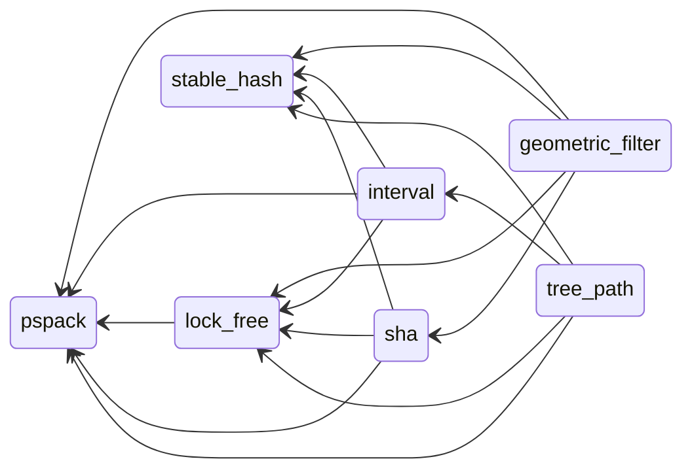

# rust-gems

A collection of rust algorithms and data structures:

- `geometric_filter`

- `interval`

- `lock_free`

- `pspack`

- `sha`

- `stable_hash`

- `tree_path`

The crate dependencies:

```mermaid
stateDiagram-v2
    direction RL

    geometric_filter --> lock_free
    geometric_filter --> pspack
    geometric_filter --> sha
    geometric_filter --> stable_hash

    interval --> lock_free
    interval --> pspack
    interval --> stable_hash

    lock_free --> pspack

    sha --> lock_free
    sha --> pspack
    sha --> stable_hash

    tree_path --> interval
    tree_path --> lock_free
    tree_path --> pspack
    tree_path --> stable_hash
```
