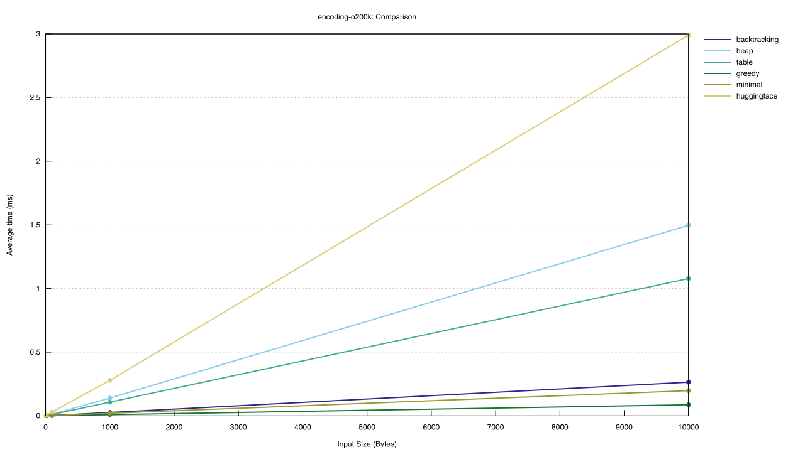
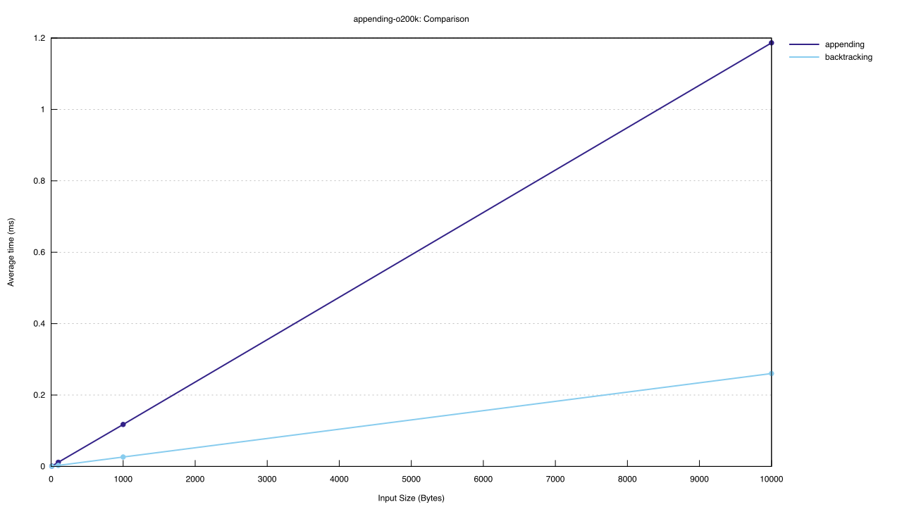
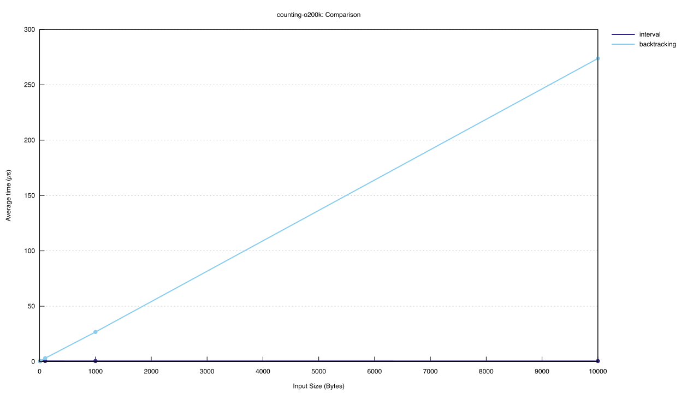
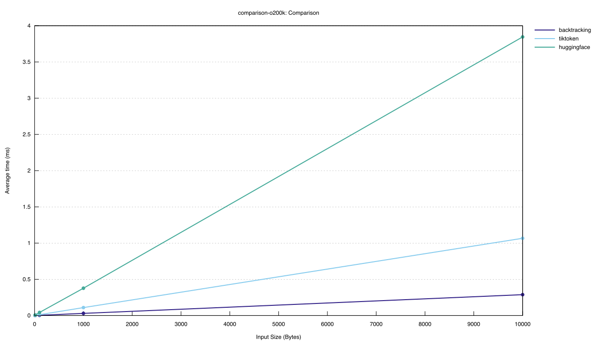
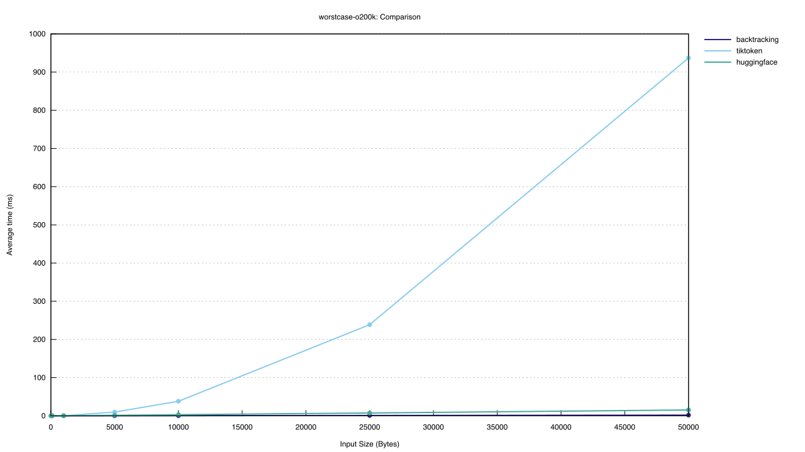

# Byte Pair Encoding

The main purpose of this library is to provide fast and correct token counting for chunking algorithms.
As a by-product, it can also be used to efficiently encode those chunks if desired.

For chunking the following operations are of interest:

1) Split text after exactly n tokens at a character boundary.
1) Count tokens for sub-ranges of a text.
1) Incrementally count tokens while appending text to a chunk.
1) Determine whether a sub-range of text is below some token limit or not.

Those operations are surprisingly difficult to implement efficiently for BPE.

The first operation would be naively implemented by first encoding the full text and then picking the first n tokens as boundary.
The problem is though that this split point might not be at a utf8 boundary. So, the trivial "solution" is to drop tokens until this condition is satisfied.
Unfortunately, the selected chunk might then be much shorter than the desired n tokens. This can happen due to some intricate tokens which neither start nor end at a character boundary.
If one manages to construct a loop of such tokens, one could trick the algorithm into returning always empty chunks with interesting consequences for a production system. One could also come up with more complicated heuristics to fix this character boundary problem, but they remain heuristics and won't solve the problem correctly in all situations.

There is also a performance problem associated with this naive approach. It first has to encodes the full text, even though one is only interested in the first n tokens!
This is particularly problematic for larger inputs.

The third operation is even more challenging, since a naive solution would either have to recompute the encoding after every append operation or approximate the total count by aggregating counts for each appended piece. The first approach suffers from quadratic complexity and the second approach from incorrect counting.
BPE counting is unfortunately non-monotonic, i.e. appending more text could result in less tokens and vice versa. In order to stay within some hard upper token limit when calling LLM APIs, one has to add some buffer to this hard limit to account for incorrect counting.

Naive implementations for the other two operations will essentially have similar problems: either performance becomes very bad or counting is imprecise.

This library presents novel algorithms to compute BPE encodings which address those problems. For the standard encoding or counting task, the algorithm will beat the Rust tiktoken implementation by 4x despite tiktoken using heuristics to speed up the encoding, but may lead to "incorrect" results.

## Prior Art

There are mostly three strategies for BPE encoding.

1) Trivial solution. Search brute force for the most frequent pair in the encoded text according the dictionary and replace those occurrences. This has a `O(n^2)` complexity and is therefore not very appealing in production.
2) Heap based. Set up a heap with the frequencies. This improves the linear search time to a logarithmic factor. If done properly, the overall complexity reduces now to `O(n log n)`.
3) Split the input into sections of a maximum size first and then process each section individually. This shrinks in theory the complexity to `O(n)` if the section size is small enough. But it will in general produce now different results. In order to produce the "correct" encoding, one would need to choose split points at token boundaries. But without having the text encoded already, this is in general impossible.

We have implemented a fast heap based solution as baseline. It uses a bitfield to mark token boundaries. This is more memory efficient than using linked lists or other approaches and should also be faster.

Note: the tik-token library uses a combination of 1) and 3) where sections are determined via a set of regular expressions. Unfortunately, this approach leads to encodings which differ from the original BPE algorithm and can therefore not be used as reference implementation for our approach, but it also has quadratic worst case complexity for certain inputs which makes it impractical for production use!

## Properties of BPE

### Definition: Byte Pair Encoding

The byte pair encoding is defined by an ordered list of tokens where the position in the list corresponds to the token id.
Thereby each multi-byte token must have been constructed from exactly two previous tokens in the list.

The encoding starts with all bytes being converted into their one-byte token ids.
Then, one scans over the preliminary encoding and determines the smallest token id by which any pair of neighboring token ids could be replaced.
The left most of them is replaced with that token id.
The process continues until no further replacement is possible.

### Definition: Valid Encoding Sequence

An encoding sequence `e_0..e_n` is said to be valid if decoding the sequence and reencoding it with BPE produces the very same sequence.
In other words, an encoding sequence is valid if it could have been produced by the original BPE algorithm.

Note: we ignore here whether the corresponding decoded text is a valid utf8 encoding!

### Corollary I: Uniqueness

There exists exactly one valid encoding sequence for any input text.

This follows immediately from the definition, since the BPE algorithm is deterministic and will therefore always produce the single one valid encoding sequence for any input text.

### Corollary II

Any substring `e_i..e_j` of a valid encoding sequence `e_0..e_n` is again a valid encoding sequence (with `0 <= i <= j <= n`).

This is obviously true, since the BPE algorithm didn't merge any characters across the token boundaries of the valid encoding sequence `e_0..e_n`.
This means that the BPE algorithm would execute exactly the same merge operations for the substring `e_i..e_j` as for the full sequence even if it only sees that substring.

### Corollary IIa

Knowing the last (or first) token of a valid encoding sequence uniquely determines the full encoding sequence.

This is a direct consequence of corollary II. Given a non-empty valid encoding sequence `e_0..e_n` for some input text `T`. Removing the last token `e_n` leads to a shorter valid encoding sequence according to corollary II which corresponds to the input text `T'` after removing the last bytes represented by the last token.
The same argument can now be applied to the shorter sequence `e_0..e_{n-1}` and the text `T'` until the full sequence is reconstructed.

### Corollary III

Given two valid encoding sequences `e_0..e_i` and `e_i..e_n`, then `e_0..e_i..e_n` is also a valid encoding sequence.
Note: that the end/start token has to be identical between the two sequences!

The correctness of this statement follows with a similar argument as used in Corollary II.
Given the merge operations performed by BPE for both valid encoding sequences. The merge operations which lead to the shared token `e_i` must be identical to produce the same token. And those are the only redundant merge operations. Combining the two sets of merge operations will lead to the combined token sequence.
If BPE wants to make a different merge decision when it sees the full input, then this merge decision must involve either the token boundary to the left or right of `e_i`. But that means that it had to make a different merge decision for at least one of the substrings `e_0..e_i` or `e_i..e_n` which cover those token boundaries. So, by contradiction, the corollary must be true.

### Corollary IIIa

Given a valid encoding sequence `e_0..e_i` and a valid encoding tuple `e_i e_j`, then `e_0..e_i e_j` is also a valid encoding sequence.

## Novel Algorithm

At a first glance, it seems impossible to achieve `O(n)` complexity while preserving the encoding output of the original BPE algorithm, since the original BPE algorithm needs to first scan the full input before it can make any encoding decision.
For instance, the sequence `abac` would be encoded as `ab ac` when the dictionary contains the tokens `a b c ab cb ac` ordered by frequency. But appending a single character `abacb` would result in a pretty different tokenization: `ab a cb`. So without looking ahead it seems impossible to properly tokenize the text.

The solution is to track the encodings of ALL text prefixes. For our example `abacb` we would get:

- `a` ------> `a`
- `ab` -----> `ab`
- `aba` ----> `ab a`
- `abab` ---> `ab ac`
- `ababc` --> `ab a cb`

This can be done much more efficiently thanks to Corollary IIa, since now only the last token of every prefix has to be remembered:

- `a` ------> `a`
- `ab` -----> `ab`
- `aba` ----> `a`
- `abac` ---> `ac`
- `abacb` --> `bc`

In order to reconstruct the full encoding for a specific prefix, one simply starts with the last token of that prefix, shortens the prefix by the extracted token and looks up the token associated with the shortened prefix and so on until the beginning of the text is reached.

For our example prefix `abacb`, this procedure executes the following steps and determines the correct encoding in reverse order:

- `abacb` -> `cb`
- `aba` ---> `a`
- `ab` ----> `ab`
- `<empty>`

The actual challenge is to determine for every prefix this last token efficiently.
The prefix `abac` could for instance end with either the token `c` or `ac`, but only `ac` leads to a valid encoding sequence.
But, Corollary IIa tells us that **one and only one** last token can be the correct one and Corollary IIIa shows us how to find it:
We only have to check whether a possible next token is "compatible" with its previous token, i.e. whether the two tokens form a valid encoding sequence.

In a naive implementation this can be done by simply decoding those two tokens, reencoding them, and testing whether the same two tokens are produced.
The fastest approach is to precompute all those pairs and then look up whether the candidate is in the valid set.
Computing this lookup table is computationally quite intensive, since dictionaries contain >100k tokens.
In case of the cl100k dictionary, already 10 billion possible pairs have to be tested to find the roughly 500 million invalid pairings.
Also storing those compactly in e.g. a bitfield requires about 1.2GB of RAM.

A more memory efficient approach is to speed up the "reencoding" operation.
The important insight here is that the reencoding can only lead to a different result if a token can cross the token boundary during the reencoding.
Once that happens the reencoding will be different and the algorithm can stop.
The actual implementation needs essentially at most 14 lookups for the most complex cases to determine whether two tokens are compatible or not.

Putting all these pieces together leads to the following algorithmic sketch:

```rust
let last_tokens = vec![];
for pos in 0..text.len() {
    for candidate in all_potential_tokens_for_suffix(text[0..pos + 1]) {
        if token_len(candidate) == pos + 1 {
            last_tokens.push(candidate);
            break;
        } else if is_compatible(last_tokens[pos + 1 - token_len(candidate)], candidate) {
            last_tokens.push(candidate);
            break;
        }
    }
}
```

The two loops can be nicely realised with the aho-corasick algorithm.
This way the overall complexity is linear in the number of overlapping matching tokens present in the input text.
An upper bound for this number could be derived for any given dictionary.
For cl100k usually about 3.5 overlapping tokens are found per input position.
But since the procedure is only interested in the first compatible match, it needs to evaluate on average just about 1.3 candidates for each position.

This algorithm consistently outperforms already the tiktoken implementation, but doesn't degrade for malicious inputs.

## Backtracking

For the average case, the previous algorithm can be improved further.
The main observation is that often the greedy heuristic picks already the correct next token.
In the cases, where it doesn't the algorithm has to somehow backtrack to the next tokenization until it converged to the correct solution.

Our backtracking implementation solves the enumeration problem as follows:

1) If the current tokenization sequence is valid, then append the longest matching token to the right.
2) Otherwise, replace the right most token with the next longest prefix token.
3) If there is no such token, then remove that token and go back to step 2.

Finding the longest matching token in step 1) can be once more done with the aho-corsaick algorithm (or just some trie implementation).
The next longest prefix token can be precomputed into a simple lookup table (in principle, the information is encoded in the aho-corasick data structure).
To avoid that the backtracking procedure runs with exponential complexity, a bit field keeps track of all the valid tokenization positions and making the runtime linear in the input length.

In the worst-case, this algorithm will perform worse than the previous one, since it has to rescan the input for the longest matching token at potentially every byte position.
On average it is about ~4 faster, since the short-cuts usually pay off.

## Benchmarks

We ran several benchmarks to compare performance of different encoders, and tiktoken and Huggingface tokenizers.
We used [tiktoken-rs](https://crates.io/crates/tiktoken-rs), a wrapper around OpenAI's tiktoken implementation, and Huggingface's [tokenizers](https://crates.io/crates/tokenizers).
Note that tiktoken does not run BPE on the full input text.
Instead it splits it into large chunks using a regex and runs BPE on the individual chunks.
We have not tried to see if that approach is compatible with our BPE implementation.
We benchmarked the following scenarios:

- The first measures encoding runtime for our different encoders and the tiktoken Rust implementation.
  This shows a ~3.5x performance improvement for our fastest correct encoder compared to the tiktoken library.

- The second measures incremental encoding runtime, where the text is built up byte-by-byte.
  This mode is not available in tiktoken, which only supports counting/encoding a complete text.

- The third measures interval counting runtime, where tokens of sub-slices of a fixed text are counted.
  The data structure we built specifically for this purpose can answer those interval counting requests in typically constant times after the initial linear preprocessing of the text.
  This mode is not available in tiktoken, which only supports counting/encoding a complete text.

All benchmarks were run single-threaded on a MacBook Pro M1.

### Encoding

Encoding is computing the tokens for a given text.
This benchmark compares several encoders:

- The backtracking encoder uses the backtracking algorithm with memorisation based on top of a string matching automaton.
- The heap encoder uses a priority heap and a bitmask to represent token positions to implement the traditional BPE algorithm.
- The table encoder implements the raw dynamic programming algorithm proposed above.
- The Huggingface BPE tokenizer.

Two additional encoders are included that are faster but deviate from the original BPE encoding strategy:

- The greedy encoder picks the left-longest token.
- The minimal encoder computes an encoding with the minimal number of tokens.

The benchmark measured the runtime of encoding of slices of lengths 10, 100, 1000, and 10000 from a random 20000 token original text using the o200k token set.
(All encodings were computed from scratch for each slice.)

Be aware that this benchmark none of the tokenizers pre-tokenize the input.
It therefore shows the true performance characteristics of the encoding logic itself.
Unfortunately tiktoken does not allow us to disable pre-tokenization, which is why it is not included.
Below we have a comparison with pre-tokenization that includes tiktoken as well.

The graph below shows encoding runtime vs slice length.
All encoders (except the heap encoder) show the expected linear runtime complexity.
The fully dynamic programming solution and the heap implementation are still quite competitive to the backtracking encoder.
If the requirement of correct BPE output can be relaxed, then the Greedy approach or the minimal encoding approach are the clear winners.
The backtracking encoder is about 10x faster than the Huggingface BPE tokenizer.



### Incremental encoding

Incremental encoding tokenizes a text while appending bytes.
This type of algorithm is interesting for use cases where a certain token budget must not be exceeded.
This benchmark shows the runtime for the appending encoder when a text is encoded byte-by-byte.
For comparison we show the runtime of the backtracking encoder when it encodes the whole text at once.

The benchmark measured the runtime of encoding of slices of lengths 10, 100, 1000, and 10000 from a random 20000 token original using the o200k token set.

The graph below shows encoding runtime vs slice length.
The overall runtime of byte-by-byte incremental encoder for encoding the full text is comparable to the runtime of the backtracking encoder, with only a constant factor overhead.
Note that this is a huge win for incremental use cases, which would otherwise require retokenization after each append, resulting in a quadratic slowdown.



### Interval counting

Interval counting is counting the tokens for a slice of an original text.
This benchmark uses two encoders:

- The backtracking encoder encodes the slice from scratch.
  This is similar to what one has to do with other libraries, like `tiktoken`.
- The interval encoder encodes the original text once and reuses that encoding to count tokens for intervals of the original text.
  The initial encoding time for the interval encoder is comparable to that of the backtracking encoder.

The benchmark measured the runtime of counting o200k tokens on slices of lengths 10, 100, 1000, and 10000 from a random 20000 token original text.

The graph below shows counting runtime vs slice length.
The runtime of the backtracking encoder grows with the length of the slice.
The interval encoder counts any interval in typically constant time.



### Comparison with other tokenizers

We compared the encoding performance of our encoder with two popular implementations, tiktoken and Huggingface tokenizers.

The benchmark measured the runtime of encoding of slices of lengths 10, 100, 1000, and 10000 from a random 20000 token original text using the o200k token set.
(All encodings were computed from scratch for each slice.)

In this benchmark all tokenizers pre-tokenize their input and produce the same tokens and decoded texts as the tiktoken tokenizer.
An effect of pre-tokenization is that the inputs to the actual BPE logic are typically much smaller than the overall input size, especially for larger inputs.
It is therefore difficult to judge the performance differences of the BPE logic fromt his benchmark.
It does give a good indication of how the algorithms might perform in practice.

The graph below shows encoding runtime vs slice length.
All encoders (except the heap encoder) show the expected linear runtime complexity.
The backtracking encoder, the fastest encoder that still returns correct results, shows a performance gain of approximately 3.5x compared to tiktoken.
The fully dynamic programming solution and the heap implementation are still quite competitive to TikToken (especially for smaller inputs).
If the requirement of correct BPE output can be relaxed, then the Greedy approach or the minimal encoding approach are the clear winners.



The graph below shows encoding results for input that is particularly challenging for tiktoken.
The input consists of random ranges taken from the continuous list of all Unicode code points excluding whitespace.
The performance of tiktoken shows a quadratic growth with the input size.
The Huggingface encoder scales better, but becomes slower and slower compared to our implementation as input size increases.



### Running the benchmarks

Benchmarks are located in a separate crate in the `benchmarks` directory.

```sh
cd benchmarks
```

Run the benchmark as follows (required [cargo-criterion](https://crates.io/crates/cargo-criterion) installed):

```sh
cargo criterion
```

(Using `cargo bench` ignores the settings in `criterion.toml`!)
Open the full report which should be located in `target/criterion/reports/index.html`.

Update the figures in this repo as follows (requires `rsvg-convert` from `librsvg` installed):

```sh
script/copy-results
```
