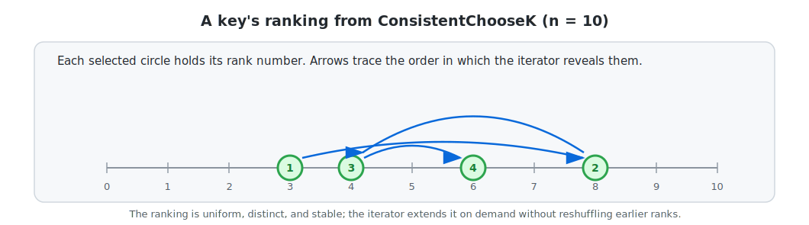
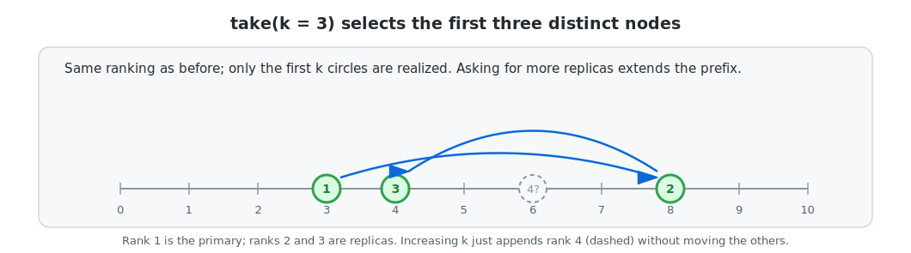
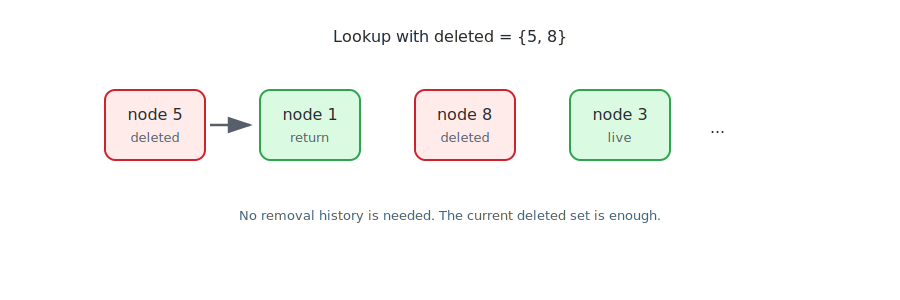
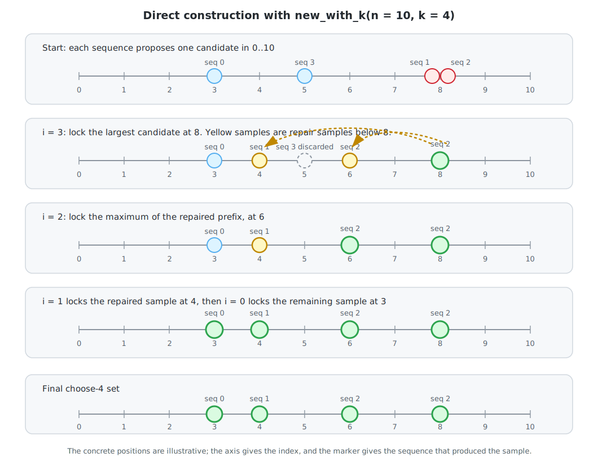
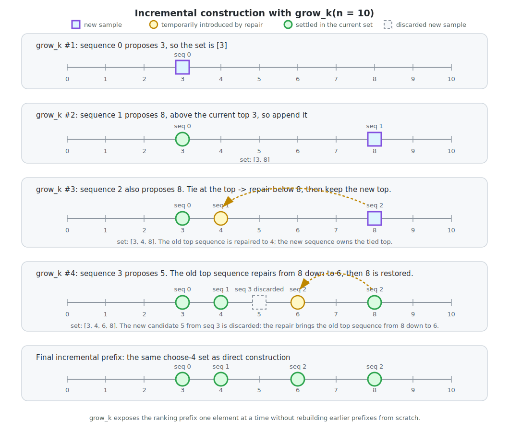

# Consistent hashing without the ring

Consistent hashing maps keys to a set of nodes so that adding or removing a
node only moves a small fraction of keys. Classical implementations reach for
a ring data structure to achieve that property.

Most consistent hashing systems start with a familiar picture: a ring, many
virtual nodes per physical node, and a clockwise walk to find owners,
replicas, or failover targets.

That model works, but it is more machinery than many applications actually
need. Rings store a large ordered table. Replication and failover require
walking that table. Good balance usually requires hundreds of virtual nodes per
physical node. Deletions introduce yet another layer of indirection or repair.

The `consistent-hashing` crate takes a different approach. Its core primitive,
`ConsistentChooseK`, directly generates a deterministic ranking of nodes for
each key:

```text
key = "photo:42"

rank 1 -> node 3
rank 2 -> node 8
rank 3 -> node 4
rank 4 -> node 6
...
```

The ranking is:

- **uniform**: each node has probability `1/n` of appearing at any given rank,
  with the same balance properties as a well-tuned ring
- **distinct**: the same node is never returned twice in a key's ranking
- **consistent in `n`**: adding or removing a node only changes the rankings of
  the keys that should actually move
- **consistent in `k`**: asking for one more replica only appends to the existing
  ranking; the previously revealed prefix never reshuffles

That one primitive can replace several specialized consistent-hashing
structures.



## From "choose one" to "choose k"

Classic consistent hashing usually answers one question:

> Which node owns this key?

But many production systems immediately need follow-up questions:

> Which nodes are the replicas?
>
> If the primary is down, who is next?
>
> If the preferred node is full, where should the key overflow?
>
> If some nodes were deleted, what is the first live candidate?

With `ConsistentChooseK`, these are all the same question:

> What is the next node in this key's ranking?

For a key and `n` nodes, the iterator yields a priority order over `0..n`.
Taking the first item gives primary placement. Taking the first `k` items gives
replication. Skipping unavailable nodes gives failover or deletion tolerance.
Checking capacity as you walk the ranking gives bounded-load assignment.

```rust
use std::hash::{DefaultHasher, Hash};
use consistent_hashing::ConsistentChooseKHasher;

let mut h = DefaultHasher::default();
"photo:42".hash(&mut h);

let replicas: Vec<_> = ConsistentChooseKHasher::new(h, 100)
    .take(3)
    .collect();
```

No ring. No virtual nodes. No per-key state.

## Why this is useful

### Replication

The first `k` items in the ranking are `k` distinct replica owners.



This avoids a subtle issue with "draw `k` independent hashes" approaches: two
draws can collide on the same node, leaving fewer than `k` distinct owners.
The choose-k ranking is distinct by construction.

### Priority failover

For failover, keep walking the same ranking:

```text
primary:     rank 1
standby:     rank 2
next backup: rank 3
...
```

If node 3 fails for a key whose ranking starts `[3, 8, 4, 6]`, node 8 takes
over. If node 8 is also unavailable, node 4 takes over. Every key has its own
stable failover order.

### Bounded load

Bounded-load consistent hashing caps how many keys a node may receive. With a
ring, a key overflows by walking to successors. With `ConsistentChooseK`, a key
overflows by asking for the next candidate in its ranking:

```text
for each key:
    for candidate in ranking(key):
        if has_capacity[candidate]:
            assign key to candidate
            decrement has_capacity[candidate]
            break
```

`has_capacity` is shared state across keys (a counter per node); the inner loop
just walks the ranking on demand. There is no virtual-node ring to build or
store.

### Arbitrary deletions

The crate also includes `ConsistentNodeMap`, a small structure for arbitrary
node deletion. It stores:

```text
total slot count
set of deleted slots
```

To look up a key, it walks the choose-k ranking until it finds a slot that is
not deleted:

```text
ranking(key) = [5, 1, 8, 3, 0, ...]
deleted      = {5, 8}

5 is deleted -> skip
1 is live    -> return 1
```



This solves the same high-level problem as several modern algorithms:

- [AnchorHash](https://arxiv.org/abs/1812.09674) keeps a fixed-size "anchor"
  array and redirects deleted slots through it.
- [MementoHash](https://arxiv.org/abs/2306.09783) stores one replacement
  tuple per deletion (a "memento") so old slots can be resolved on lookup.
- [DxHash](https://arxiv.org/abs/2107.07930) generates pseudo-random
  permutations and chases redirect chains.

All three guarantee that when a node is removed, only the keys assigned to
that node move, and those keys are redistributed uniformly among the remaining
nodes. The difference between `ConsistentNodeMap` and the other three is what
they need to remember:

- **History-dependent** (AnchorHash, MementoHash, DxHash): the data structure
  must record the sequence of removals (and sometimes re-additions) to be able
  to resolve a lookup. Two systems that ended up with the same set of deleted
  slots through different removal orders will hold different state and may
  disagree on which node owns a given key.
- **History-independent** (`ConsistentNodeMap`): the data structure stores only
  the *current* deleted set. The same set of deletions, in any order, gives
  the same lookups. This makes replication and recovery dramatically simpler.

## A simpler alternative to virtual-node rings

Hash rings with virtual nodes remain a useful mental model, but they pay for
balance with memory. A common deployment uses hundreds of virtual nodes per
physical node, so the ring state is orders of magnitude larger than the actual
node list.

`ConsistentChooseK` generates each key's preference list directly. For
replication and failover, it needs no persistent data structure. For arbitrary
deletions, `ConsistentNodeMap` stores only deleted slots.

| Approach | Persistent state | Replicas/failover | Arbitrary deletions |
| --- | --- | --- | --- |
| Hash ring with virtual nodes | `O(V * nodes)` ring entries | Walk ring successors | Remove `V` virtual nodes per physical node |
| AnchorHash | `O(capacity)` state | Not the main abstraction | Yes, history-dependent |
| MementoHash | `O(deleted)` replacement tuples | Not the main abstraction | Yes, history-dependent |
| DxHash | `O(capacity)` state | Not the main abstraction | Yes, history-dependent |
| `ConsistentChooseK` | `O(1)` | Native ranking prefix | Via `ConsistentNodeMap` |
| `ConsistentNodeMap` | `O(deleted)` deleted set | Walk ranking and skip deleted slots | Yes, history-independent |

## How the algorithm works

There are two useful ways to compute the same choose-k structure:

1. build the whole `k`-element sample set directly with `new_with_k`
2. start with `k = 0` and incrementally reveal the next ranked node with
   `grow_k`, which is what the iterator uses

Both versions use the same small building block. For sequence `i`, sample a
consistent hash in a range that has been shifted by `i`:

```text
sample(i, n) = consistent_hash(sequence = i, range = n - i) + i
```

The shift makes `sample(i, n)` live in `i..n`. Concretely, `sample(2, 10)`
draws a hash in `0..8` and then adds `2`, so it lands somewhere in `{2, 3, 4,
5, 6, 7, 8, 9}`. Because sequence `0` lives in `0..n`, sequence `1` in `1..n`,
sequence `2` in `2..n`, and so on, the `k` sequences live in nested ranges
that always have room for `k` distinct values. This is what lets the algorithm
combine `k` independent sequences into `k` distinct nodes without rejection
sampling.

### Direct construction: `new_with_k`

When the requested `k` is known up front, `new_with_k(builder, n, k)` builds
the selected set in one right-to-left pass, in `O(k^2)` time (each of the `k`
lock steps may resample up to `k` lower slots).

First, each sequence proposes one candidate in the full range:

```text
sequence:     0    1    2    3
candidate:    3    8    8    5
```

Then the constructor sweeps from right to left. At step `i`, it takes the
largest candidate among `0..=i` and locks it into slot `i`. If any lower slot
collided with that locked position, that slot is resampled below the locked
position. For the toy candidates above, the whole construction looks like this:



Notice that the original candidate of sequence 3 is discarded in the first
locking step. Slot 3 does not necessarily keep the candidate produced by
sequence 3; it stores the maximum candidate among all sequences `0..=3`.
Sequence 3's candidate was `5`, but the maximum was `8`, produced by lower
sequences. Once `8` is locked as the largest selected node, sequence 3 has done
its job: it participated in the competition for the top slot, but it does not
continue into the smaller prefix problem.

Also notice that the same sequence label can show up twice in the final set:
sequence 2 produced the tied top at `8` and then, during the repair below `8`,
contributed a second sample at `6`. Sequence indices are an implementation
detail of how samples are generated; the choose-k *set* of positions is what
the caller observes.

This gives a sorted `k`-element set. The recursive flavor is visible in the
repair step: once the largest selected node is fixed at position `m`, the
remaining nodes must be chosen consistently from the prefix `0..m`.

### Incremental ranking: `grow_k` and `shrink_n`

The iterator could call `new_with_k(builder, n, k)` from scratch for every new
`k`, but that would repeat almost all previous work. If you ask for ranks
`1, 2, 3, ...`, rebuilding each prefix separately turns an `O(k^2)` construction
into a much more expensive cumulative process.

Instead, the iterator maintains the current choose-k state and grows it by one
rank at a time.

```text
take(1) -> grow_k once
take(2) -> grow_k twice
take(3) -> grow_k three times
```

Using the same toy sequence as above, the incremental path builds the same
final set `[3, 4, 6, 8]`:



The easy case is when the new sequence produces a candidate above the current
largest sample. In the figure, this happens when `seq 1` produces `8` while the
current set is `[3]`. `grow_k` can simply append it, producing `[3, 8]`.

The interesting case is when the new sequence lands at or below the current
largest sample. If it loses to the current top, that top remains part of the new
`k + 1` set, but the lower `k` samples need to be recomputed in the smaller
universe below it. This is exactly what `shrink_n` already does: it shrinks the
universe to the current maximum and cascades the necessary repairs downward.
After that repair, `grow_k` pushes the old maximum back on top. In the figure,
this happens twice: when `seq 2` ties the current top `8`, and when `seq 3`
proposes `5`, causing the old top sequence to repair from `8` down to `6`
before `8` is restored.

In pseudocode:

```text
grow_k():
    new = sample(sequence = k, n)
    top = current largest sample

    if new is above top:
        append new                # easy case, no repair needed
    else:
        repair_below(top.position)  # rerun shrink_n in the universe 0..top
        append top                  # restore the old maximum
```

(`repair_below` is `shrink_n_inner` in the implementation - it is the same
primitive used by `shrink_n` to update samples when the universe shrinks.)

If `new` ties the old top position, the same repair is needed, but the new
sequence becomes the sample at that top position.

This decomposition is useful because the repair step is not just an
implementation detail. It captures the consistency relation in `n`: when the
universe shrinks to the current maximum, the algorithm can update the sample
set without starting over. `grow_k` uses that primitive to make consistency in
`k` incremental, at amortized `O(k)` per element revealed (so `O(k^2)` for the
full prefix - the same as the direct constructor, but paid one rank at a
time).

## Complexity in practice

The current implementation extracts the first `k` candidates in `O(k^2)` time.
A heap optimization can reduce this to `O(k log k)`. For the most common
values of `k` - one primary, two choices, three replicas - the simple version
is small and fast.

For deletion-tolerant lookup, let `h` be the number of deleted slots encountered
before the first live slot. The current iterator costs `O((h + 1)^2)` for that
lookup. Under random removals, `h` follows a harmonic/log distribution similar
to those analyzed for history-based approaches:

```text
E[h] is roughly ln(total / active)
```

For example, if 10% of slots are deleted (`total = 1.11 * active`), then
`E[h] ≈ 0.1` and the expected lookup work is essentially constant. The penalty
only becomes visible once `total / active` is much greater than `1`.

## When this is not the right tool

`ConsistentChooseK` is a good fit when you map keys to nodes (or queues, or
shards) and care about the four properties at the top of this post. It is
*not* a drop-in replacement for the ring everywhere:

- **Range queries on the hash space.** Some systems use the ring's geometry
  to scan adjacent shards or to support range partitioning. Choose-k gives an
  *unordered* set of `k` nodes per key, not a position on a cycle.
- **Locality between keys.** With a ring, keys whose hashes land near each
  other share owners. Choose-k breaks that correlation by design (which is
  usually what you want, but worth knowing).
- **Very large `k` and tiny `n`.** When `k` approaches `n` (say, you want a
  full permutation of the nodes per key), there are simpler permutation
  schemes. Choose-k is at its best when `k` is much smaller than `n`.
- **You already have a tuned, well-tested ring.** Migrating live data to a
  new hashing scheme is a real cost. The choose-k API is worth adopting when
  the simplification it brings (no virtual nodes, no history-tracking
  deletions) outweighs that cost.

## Why this matters

The main value is not just a new consistent hashing function. It is that one
small primitive gives a clean way to express several higher-level placement
policies:

- primary placement
- replication
- priority failover
- bounded-load assignment
- power-of-two choices
- arbitrary deletion handling

Instead of building a different data structure for each policy, use the same
per-key ranking and compose the policy on top.

That makes the resulting systems easier to reason about: the ranking is stable,
distinct, uniform, and generated on demand.

## Try it

The crate lives in the [`rust-gems`](https://github.com/github/rust-gems)
workspace:

```toml
[dependencies]
consistent-hashing = { git = "https://github.com/github/rust-gems" }
```

Two entry points cover most uses:

- `ConsistentChooseKHasher::new(builder, n)` - an iterator over the per-key
  ranking. Use `.take(k)` for replicas, `.find(...)` for failover, or a
  bounded loop for capacity-aware placement.
- `ConsistentNodeMap` - a node map that supports arbitrary additions and
  removals while preserving the four ranking properties above.

See the [crate README](../README.md) for the full API, doc examples, and the
statistical test suite that validates uniformity and minimal-disruption after
removals.
