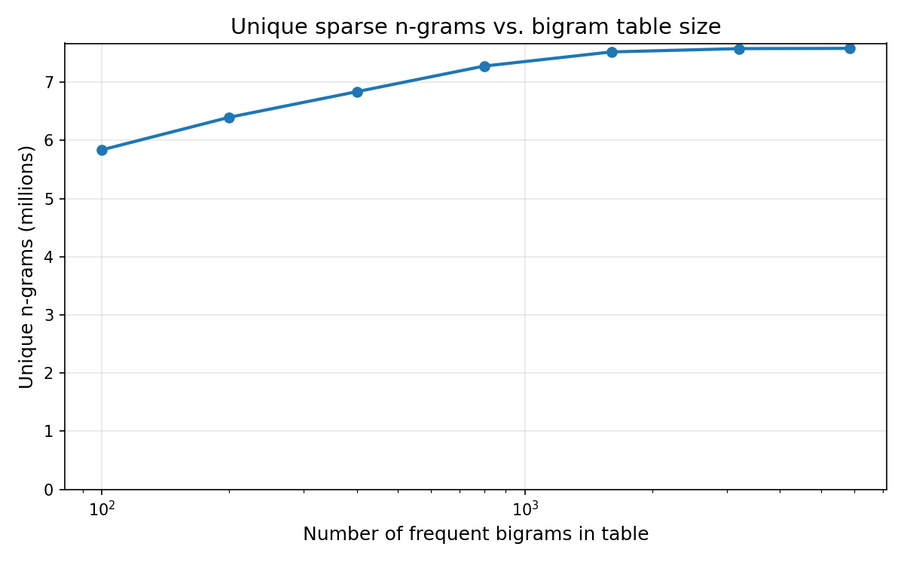

# sparse-ngrams

Fast sparse n-gram extraction from byte slices.

Sparse grams select variable-length n-grams (2–8 bytes) without extracting all possible substrings. The algorithm is deterministic: the same extraction logic applies to every substring, making it suitable for substring search indexes.

## How it works

Each consecutive byte pair (bigram) is assigned a frequency-based priority from a precomputed table. An n-gram boundary occurs wherever a bigram has lower priority than all bigrams between it and the previous boundary. This is computed efficiently using a monotone deque or a scan-based approach.

For a document of N bytes, this produces at most 3(N−1) n-grams: N−1 bigrams, plus up to 2(N−1) algorithmically selected longer n-grams (up to 8 bytes).

### Selection criterion

A substring of length 3–8 is emitted as a sparse n-gram if and only if every interior bigram priority is strictly greater than the maximum of the left and right boundary bigram priorities.

## Usage

```rust
use sparse_ngrams::{collect_sparse_grams, NGram, MAX_SPARSE_GRAM_SIZE};

let input = b"hello world";
let grams = collect_sparse_grams(input);
for gram in &grams {
    assert!(gram.len() >= 2);
    assert!(gram.len() <= MAX_SPARSE_GRAM_SIZE as usize);
}
```

## Performance

Benchmarks on an Apple M1 (15 KB input, `lib.rs` source file):

| Variant | Throughput |
|---------|-----------|
| `deque` | ~3.5 GB/s |
| `scan`  | ~4.9 GB/s |

The `scan` variant is ~40% faster than the deque variant by replacing the monotone deque with a fixed-size circular buffer and a suffix-minimum scan.

## Bigram table size

The priority table maps byte pairs to frequency-based priorities. Increasing the table size (number of ranked bigrams) produces more distinct longer n-grams, but saturates quickly:



| Table size | Unique n-grams | % of max |
|-----------|---------------|----------|
| 100       | 6.2M          | 79.4%    |
| 200       | 6.7M          | 85.9%    |
| 400       | 7.1M          | 91.1%    |
| 800       | 7.5M          | 96.2%    |
| 1,600     | 7.8M          | 99.0%    |
| 3,200     | 7.8M          | 99.9%    |
| 6,400+    | 7.8M          | 100%     |

Beyond ~6,400 entries the table saturates — additional bigram rankings produce no new n-grams since all occurring byte pairs already have distinct priorities.

## Maximum n-gram length

Increasing the maximum n-gram length produces more unique longer grams, with diminishing returns:


| Max length | Unique n-grams | vs. len=8 |
|-----------|---------------|-----------|
| 2         | 1.4M          | 18%       |
| 3         | 4.6M          | 59%       |
| 4         | 5.8M          | 74%       |
| 6         | 7.1M          | 90%       |
| 8         | 7.8M          | 100%      |
| 12        | 8.7M          | 111%      |
| 16        | 9.2M          | 118%      |
| 24        | 9.8M          | 124%      |
| 32        | 10.0M         | 128%      |
| 48        | 10.3M         | 131%      |
| 64        | 10.4M         | 132%      |

The default of 8 captures most of the discriminative power. Going to 16 adds ~18% more unique grams but doubles the scan window; going to 64 adds only ~32% total.
