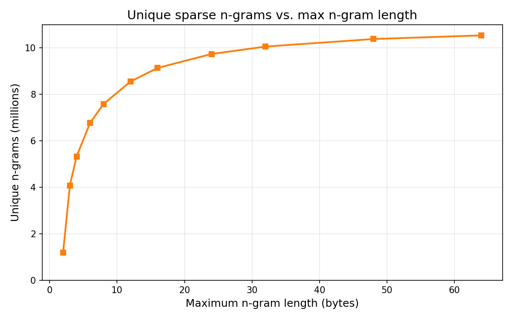

# sparse-ngrams

Fast sparse n-gram extraction from byte slices.

Sparse grams select variable-length n-grams (2–8 bytes) without extracting all possible substrings. The algorithm is deterministic: the same extraction logic applies to every substring, making it suitable for substring search indexes.

For background, see:
- [The technology behind GitHub's new code search](https://github.blog/engineering/architecture-optimization/the-technology-behind-githubs-new-code-search/#fn-69904-bignote)
- [Sparse n-grams: smarter trigram selection](https://cursor.com/blog/fast-regex-search#sparse-n-grams-smarter-trigram-selection)

## Caveats

The bigram priority model only scores index-folded ASCII byte pairs; any byte with the high bit set resolves to priority `0`. Correct output requires index-folding and normalization with the [casefold](../casefold) crate in this workspace before extraction (including folding uppercase to lowercase and mapping non-ASCII bytes to high-bit-set bytes). This makes the implementation suitable for case-insensitive search indexes.

## How it works

Each consecutive byte pair (bigram) is assigned a frequency-based priority from a compact factored model (see [Bigram priority model](#bigram-priority-model)). An n-gram boundary occurs wherever a bigram has lower priority than the bigrams between it and the previous boundary. This is computed efficiently using a monotone deque or a scan-based approach.

For a document of N bytes, this produces at most 3(N−1) n-grams: N−1 bigrams, plus up to 2(N−1) algorithmically selected longer n-grams (up to 8 bytes).

Each n-gram is returned as an opaque 32-bit `NGram` key that packs the byte length together with a payload — the raw bytes for grams of 3 bytes or fewer, a multiplicative hash for longer ones — so grams of different lengths never collide. The packed value is run through a bijective mixing permutation so the key bits are well distributed.

### Selection criterion

A substring of length 3–8 is emitted as a sparse n-gram when both its left and right boundary bigram priorities are strictly less than every interior bigram priority.

## Usage

```rust
use sparse_ngrams::{collect_sparse_grams, NGram, MAX_SPARSE_GRAM_SIZE};

let input = b"hello world";
let grams = collect_sparse_grams(input);
for gram in &grams {
    assert!(gram.len() >= 2);
    assert!(gram.len() <= MAX_SPARSE_GRAM_SIZE);
}
```

## Performance

Throughput on an Apple M4 Max (the ~15 KB `benchmarks/fixtures/sample_code.txt` corpus):

| Variant | Throughput |
|---------|-----------|
| `deque` | ~220 MiB/s |
| `scan`  | ~320 MiB/s |

The `scan` variant is ~45% faster than the deque variant by replacing the monotone deque with a fixed-size circular buffer and a suffix-minimum scan.

The factored bigram model computes each priority (instead of reading a large lookup table) and each key is passed through a mixing permutation. Compared to the earlier table-based implementation this trades roughly 1.6× throughput for a ~7.5× smaller table (~8.5 KB vs ~64 KB in memory) and better-distributed keys.

## Bigram priority model

Priorities come from a compact factored model (~8.5 KB) rather than a full 256×256 lookup table (~64 KB in memory). The ASCII bigram `(a, b)` is scored as `H[a] + H[b] + (code << 8) + 1`, where `H` is a shared 128-entry per-byte weight and `code` is a 4-bit per-bigram correction; a per-bigram index folded into the low bits makes every priority unique while a higher score still means a more frequent bigram. The model was tuned offline against a frequency ranking from a large code corpus (~1.9% inversions vs. the exact ranking).

## Maximum n-gram length

Increasing the maximum n-gram length produces more unique longer grams, with diminishing returns:



| Max length | Unique n-grams | vs. len=8 |
|-----------|---------------|-----------|
| 2         | 1.2M          | 16%       |
| 3         | 4.1M          | 54%       |
| 4         | 5.3M          | 70%       |
| 6         | 6.8M          | 89%       |
| 8         | 7.6M          | 100%      |
| 12        | 8.5M          | 113%      |
| 16        | 9.1M          | 120%      |
| 24        | 9.7M          | 128%      |
| 32        | 10.1M         | 133%      |
| 48        | 10.4M         | 137%      |
| 64        | 10.5M         | 139%      |

The default of 8 captures most of the discriminative power. Going to 16 adds ~20% more unique grams but doubles the scan window; going to 64 adds only ~39% total.
